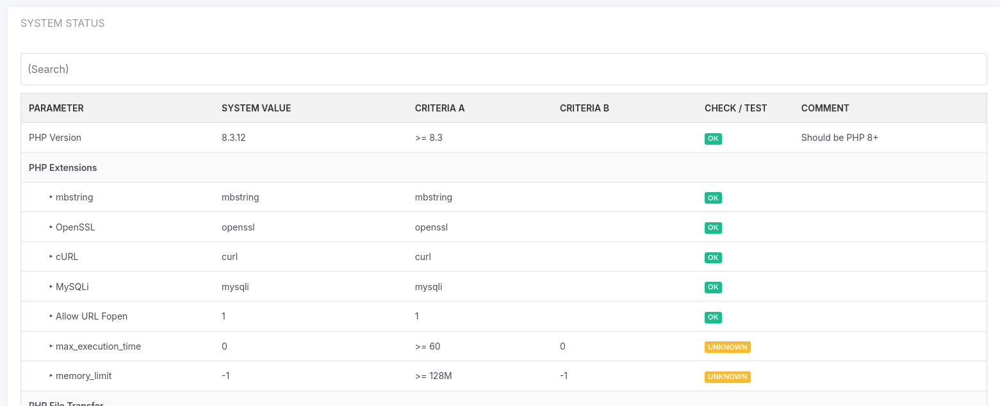

# yii2-system-status

Yii2 module to see system conditions via a check table. This module allows you to monitor various system statuses and configurations directly from your Yii2 application.

## Features

- Monitor various system checks like PHP extensions, configuration limits, and command outputs.
- Easily customizable checks through a dedicated database table.
- Supports multiple criteria for checks, including numerical, version, and string comparisons.



## Installation
Create table (table name is system_check) and insert some inital values.

```bash
php yii migrate
```

You can install this package via Composer. Run the following command in your terminal:

```bash
composer require strtob/yii2-system-status
```

Adjust your config in web.php or main.php
```bash
 'system-status' => [
            'class' => strtob\yii2SystemStatus\Module::class,
        ],
```
After installation the module is accessable via 
```bash
http://localhost:8080/system-status
```
